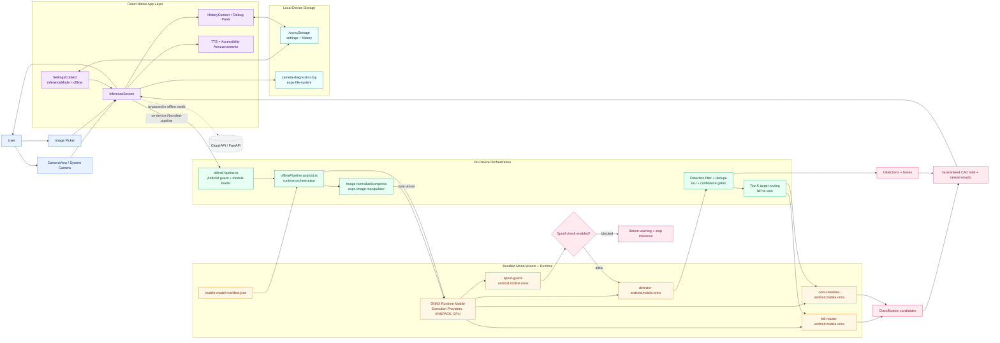

# SeeMyCash On-Device Mode Architecture (Mermaid)

```mermaid
flowchart LR
    %% -----------------------------
    %% Clients & entry points
    %% -----------------------------
    U[User]
    C1[CameraView / System Camera]
    C2[Image Picker]
    U --> C1
    U --> C2

    %% -----------------------------
    %% React Native app layer
    %% -----------------------------
    subgraph APP[React Native App Layer]
      S1[InferenceScreen]
      S2[SettingsContext<br/>inferenceMode = offline]
      S3[HistoryContext + Debug Panel]
      S4[TTS + Accessibility Announcements]
    end

    C1 --> S1
    C2 --> S1
    S2 --> S1

    %% -----------------------------
    %% On-device orchestration
    %% -----------------------------
    subgraph ORCH[On-Device Orchestration]
      O1[offlinePipeline.ts<br/>Android guard + module loader]
      O2[offlinePipeline.android.ts<br/>runtime orchestration]
      O3[Image normalize/compress<br/>expo-image-manipulator]
      O4[Top-K target routing<br/>bill vs coin]
      O5[Detection filter + dedupe<br/>IoU + confidence gates]
    end

    S1 -->|on-device://bundled-pipeline| O1
    O1 --> O2
    O2 --> O3

    %% -----------------------------
    %% Model bundle + runtime
    %% -----------------------------
    subgraph MODELS[Bundled Model Assets + Runtime]
      M0[mobile-model-manifest.json]
      M1[spoof-guard-android.mobile.onnx]
      M2[detector-android.mobile.onnx]
      M3[bill-reader-android.mobile.onnx]
      M4[coin-classifier-android.mobile.onnx]
      R1[ONNX Runtime Mobile<br/>Execution Providers: XNNPACK, CPU]
    end

    M0 --> O2
    O3 -->|byte tensor| R1
    O2 --> R1
    R1 --> M1
    R1 --> M2
    R1 --> M3
    R1 --> M4

    %% -----------------------------
    %% Pipeline stages
    %% -----------------------------
    M1 --> P1{Spoof check enabled?}
    P1 -->|blocked| P2[Return warning + stop inference]
    P1 -->|allow| M2

    M2 --> O5
    O5 --> O4
    O4 --> M3
    O4 --> M4

    %% -----------------------------
    %% Outputs
    %% -----------------------------
    M3 --> X1[Classification candidates]
    M4 --> X1
    O5 --> X2[Detections + boxes]
    X1 --> X3[Guaranteed CAD total + ranked results]
    X2 --> X3
    X3 --> S1
    S1 --> S3
    S1 --> S4
    S1 --> U

    %% -----------------------------
    %% Local persistence/diagnostics
    %% -----------------------------
    subgraph LOCAL[Local Device Storage]
      L1[AsyncStorage<br/>settings + history]
      L2[camera-diagnostics.log<br/>expo-file-system]
    end

    S2 <--> L1
    S3 <--> L1
    S1 --> L2

    %% -----------------------------
    %% Cloud path bypass in offline mode
    %% -----------------------------
    CLOUD[(Cloud API / FastAPI)]
    S1 -. bypassed in offline mode .-> CLOUD

    %% -----------------------------
    %% Styling
    %% -----------------------------
    classDef ui fill:#E8F1FF,stroke:#2F6FED,stroke-width:1px,color:#0A2458;
    classDef app fill:#F3E8FF,stroke:#7E22CE,stroke-width:1px,color:#3B0764;
    classDef orch fill:#E8FFF4,stroke:#059669,stroke-width:1px,color:#064E3B;
    classDef model fill:#FFF7E6,stroke:#D97706,stroke-width:1px,color:#7C2D12;
    classDef out fill:#FFEAF0,stroke:#DB2777,stroke-width:1px,color:#831843;
    classDef local fill:#ECFEFF,stroke:#0E7490,stroke-width:1px,color:#083344;
    classDef cloud fill:#F3F4F6,stroke:#6B7280,stroke-dasharray: 5 5,color:#111827;

    class U,C1,C2 ui;
    class S1,S2,S3,S4 app;
    class O1,O2,O3,O4,O5 orch;
    class M0,M1,M2,M3,M4,R1 model;
    class P1,P2,X1,X2,X3 out;
    class L1,L2 local;
    class CLOUD cloud;
```

